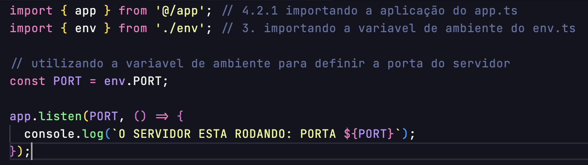
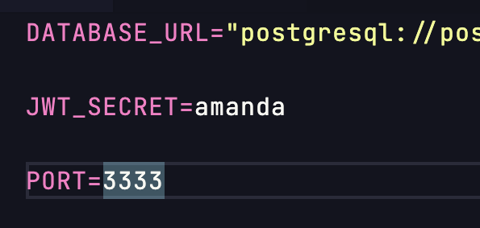

# DEPLOY
## BUILD DO PROJETO
É a versão transformada, otimizada e pronta pra rodar em produção do seu código.

Pensa assim:
🧑‍💻 Você escreve código “bonito”
🚚 A build é a versão “pronta pra entregar”: convertida para JavaScript puro (Node entende), compactada, sem arquivos desnecessários, sem TypeScript, sem testes, sem comentários (às vezes), com tree-shake (remove o que não é usado), na pasta /build ou /dist

📦 POR QUE A BUILD EXISTE?
- Servidores não aceitam TypeScript.
- O código precisa estar otimizado e rápido.
- A estrutura muda pra ficar mais eficiente.

**O deploy só envia arquivos realmente necessários**

1. normalmente os projetos que vamos fazer deploy, vao vir sem o **node_modules** e sem o **.env**, nesse caso adicionamos ambos os arquivos
- para instalar o node: `npm i`
- .env criamos manualmente

2. adicionando na variavel de ambiente a porta - no arquivo: **env.ts**
- `PORT: z.coerce.number().default(3333),`

3. no server.ts adicionamos a variavel de ambiente para poder definir a porta padrão que foi passada la

4. adicionando no .env a PORT=3333 
- 

5. para o ambiente de produção, nao precisamos do typescript, somente o javascript pura
- instalamos um utilitario para fazer essa conversao 
  - `npm i tsup -D`

- em seguida, criamos o script de build: "build": "tsup src" e rodamos
  - `npm run build`
  - isso vai gerar uma pasta chamada "dist", que por padrão renomeamos para "build", mas pra isso temos que apagar a pasta e no script configuramos para que o nome venha do jeito que queremos: `"build": "tsup src --out-dir build"`

6. testando a build
- `node --env-file=.env build/server.js`
- passando esse codigo para um script: **"start": "node --env-file=.env build/server.js"**
- vamos criar uma variavel de ambiente dentro da build do deploy, entao a partir daqui o start ficara assim: **"start": "node build/server.js"**

7. no package.json => versão minima:  `"engines": { "node": ">=18" },`
8. passando para o gitignore a pasta build, o deploy gera ela automaticamente
9. passando o projeto para o github